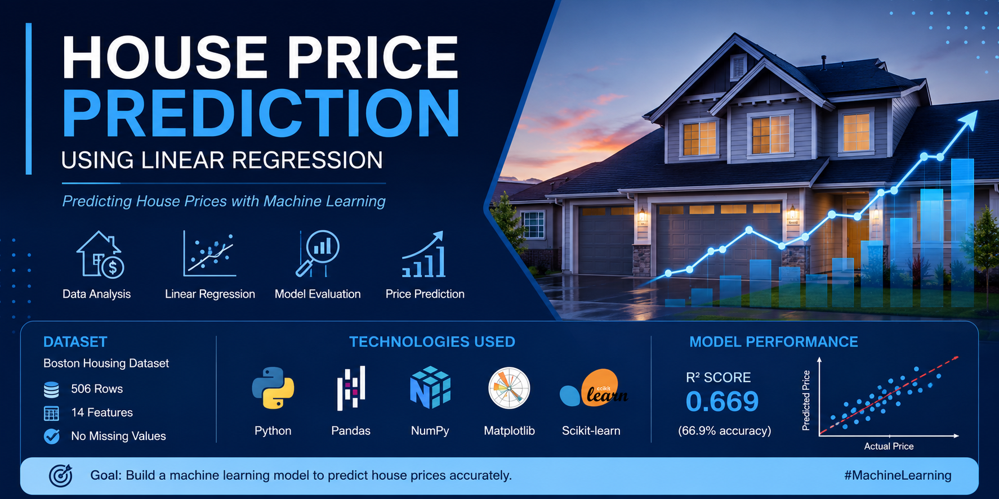

# 🏠 House Price Prediction using Linear Regression



## 📌 Project Overview

This project predicts house prices using the **Linear Regression** machine learning algorithm. The model is built using the **Boston Housing Dataset** and demonstrates the complete machine learning workflow, including data loading, preprocessing, model training, prediction, evaluation, and visualization.

---

## 🚀 Features

- Load and analyze the Boston Housing dataset
- Explore and understand the data
- Train a Linear Regression model
- Predict house prices
- Evaluate model performance using R² Score
- Visualize Actual vs Predicted house prices

---

## 🛠 Technologies Used

- Python
- Pandas
- NumPy
- Matplotlib
- Scikit-learn

---

## 📂 Dataset

- **Dataset:** Boston Housing Dataset
- **Rows:** 506
- **Columns:** 14
- **Missing Values:** 0

---

## 📊 Machine Learning Workflow

1. Load the dataset
2. Explore the dataset
3. Select features and target
4. Split data into training and testing sets
5. Train the Linear Regression model
6. Predict house prices
7. Evaluate model accuracy
8. Visualize the results

---

## 📈 Model Performance

- **Algorithm:** Linear Regression
- **R² Score:** **0.669 (66.9%)**

---

## 📷 Output

The project generates:

- Predicted house prices
- Actual vs Predicted scatter plot
- Model accuracy (R² Score)

---

## 📁 Project Structure

```
House-Price-Prediction/
│── house_price_prediction.py
│── README.md
│── requirements.txt
│── graph.png
│── banner.png
```

---

## ▶️ How to Run

1. Clone this repository

```bash
git clone https://github.com/yourusername/House-Price-Prediction.git
```

2. Install dependencies

```bash
pip install -r requirements.txt
```

3. Run the project

```bash
python house_price_prediction.py
```

---

## 💡 Future Improvements

- Random Forest Regression
- Decision Tree Regression
- XGBoost Regressor
- Hyperparameter Tuning
- Deploy as a web application using Streamlit

---

## 👨‍💻 Author

**Hemanth Gowda**

GitHub: https://github.com/hemanthgowdaofficial1823-sketch

LinkedIn: https://www.linkedin.com/in/hemanth-gowda-bb8450390/

---

## ⭐ If you like this project

Give this repository a ⭐ on GitHub!
